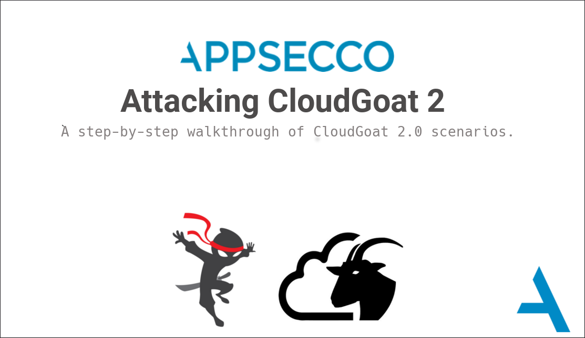

# Attacking CloudGoat 2

## What is this book about?

This book aims to be a step-by-step walkthrough of CloudGoat 2.0 scenarios.

[CloudGoat 2.0](https://rhinosecuritylabs.com/aws/introducing-cloudgoat-2/) is a "vulnerable by design" AWS deployment tool. CloudGoat allows users to create intentionally vulnerable AWS environments. 

## Who this book is for?

The intended audience for this book are - 

1. Penetration testers, who are interested in learning to attack AWS services
2. Developers/System Administrators/Cloud Engineers who are interested in understanding the attack surface around AWS services

## Setting up the book

The book is written in markdown format, you can use [mdBook](https://github.com/rust-lang/mdBook) to host a local copy.

### Steps to do this

1. Install Rust by following the instructions at https://www.rust-lang.org/tools/install
2. Install mdBook (`cargo install mdbook`) or download binaries from [https://github.com/rust-lang/mdBook/releases](https://github.com/rust-lang/mdBook/releases)
2. `cd` into the `documentation` folder
3. `mdbook serve`
4. Browse to `http://localhost:3000`

## License

- The book contents are released under [Creative Commons Attribution Share Alike 4.0 International](CC-BY-SA-LICENSE.txt)
- Any code, script, commands are release under [MIT License](MIT-LICENSE.txt)

## Reader feedback

Feedback from readers is expected and appreciated. We are actively looking forward to improving the book. Let us know what you think about this book — what you liked or may have disliked. Reader feedback is important for us to develop more books.

If you find mistakes, omissions, errors or blatant lies in this document, please send me a refreshed version of the affected paragraph and I will make amended versions. I will give proper credits to everyone who helps out! I hope to make this document better over time.

You can provide the feedback by raising an issue in this repo.

## About Appsecco

At Appsecco we provide advice, testing and training around software, infra, web and mobile apps, especially that are cloud hosted. We also specialise in auditing AWS environments as per the AWS CIS Foundations Benchmark to create a picture of the current state of security in your AWS environment. Our experience has led us to creating multiple hands on training courses like the very popular “Breaking and Pwning Apps and Servers on AWS and Azure” and “Automated Defence using Cloud Services for AWS, Azure and GCP”.

* https://appsecco.com
* https://blog.appsecco.com

## Acknowledgments

- Ninja image design vector created by [freepik](https://www.freepik.com/free-photos-vectors/design)

