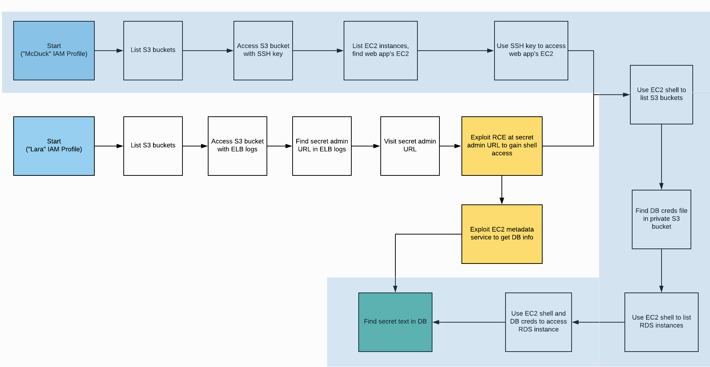
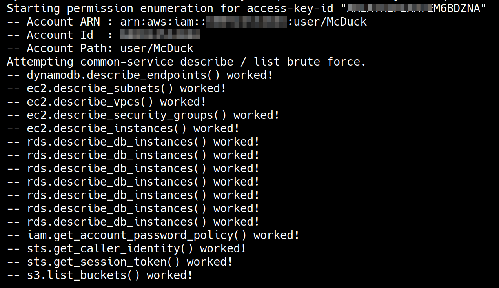
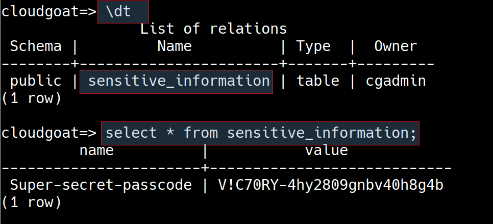
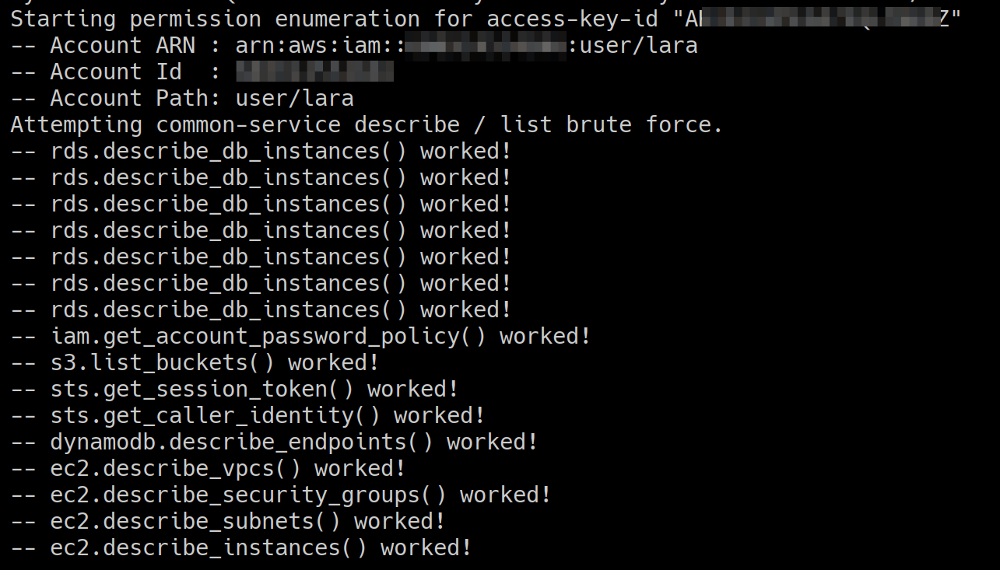
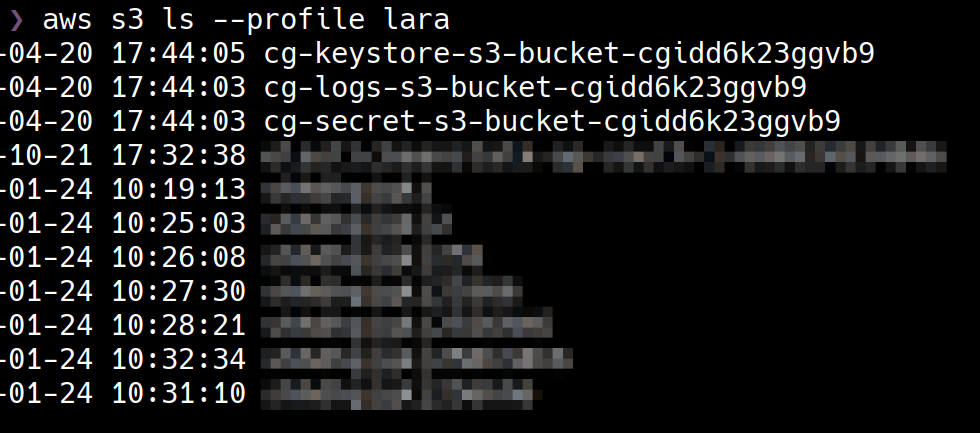
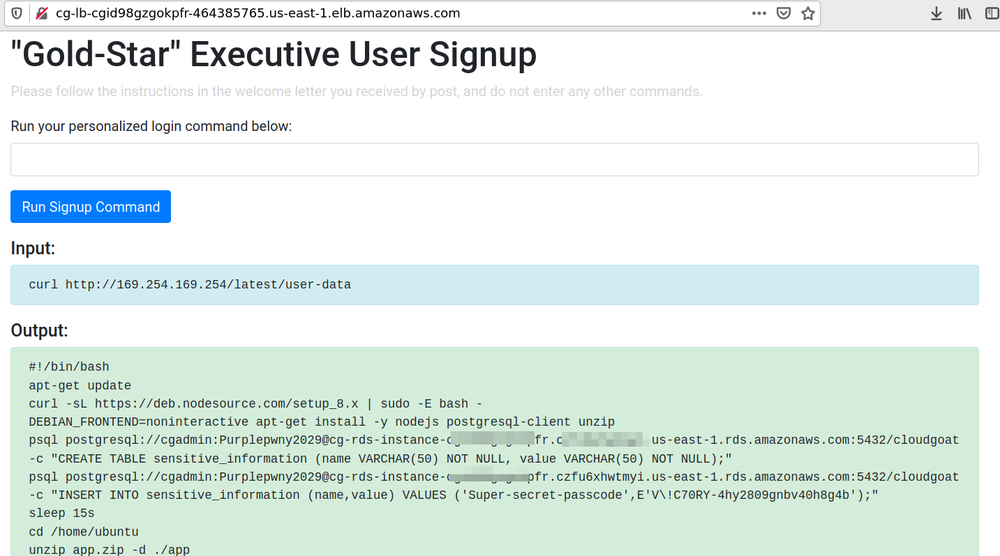

# Scenario 5 - RCE Web App

## What is the scenario

The scenario begins with security credentials of two IAM users - "Lara" and "Mcduck" 

The objective is to find a secret stored in the RDS database.

More scenario details - https://github.com/RhinoSecurityLabs/cloudgoat/blob/master/scenarios/rce_web_app/README.md

## Setting up the scenario

        python3 cloudgoat.py create rce_web_app

## Walkthrough

There are multiple routes to completing this secenario. We'll cover them independently.

### Exploitation Route - 1

### Step by step instructions

In this scenario, we have credentials of two IAM Users to being with - Lara and McDuck. We'll use the credentials of IAM User McDuck for this exploitation route.

Let's use [enumerate-iam](https://github.com/andresriancho/enumerate-iam) script to quickly verify what we can do with the IAM user "McDuck" security credentials.

IAM User McDuck has some EC2, RDS and S3 related permissions.

Let's go ahead and list the S3 Buckets in the AWS account.

        aws s3 ls --profile mcduck

There are three CloudGoat related Buckets in the AWS account. Let's try and download the contents of the S3 Buckets.

        aws s3 sync s3://<BUCKET_NAME> . --profile mcduck

IAM User McDuck has permissions to download objects from only one Bucket, `cg-keystore-s3-bucket-<CLOUDGOAT_ID>`. The files downloaded looks like an SSH Key Pair. 

Now that we have an SSH Key Pair and ability to list EC2 instances, let's see if there are any EC2 instances that we can try and SSH into.

         aws ec2 describe-instances \
        --query "Reservations[*].Instances[*].Tags" \
        --output text \
        --profile mcduck

There is an EC2 instance running in the AWS account. Let's use the SSH Key Pair we downloaded to SSH into the EC2 Instance.

        aws ec2 describe-instances \
        --query "Reservations[*].Instances[*].PublicIpAddress" \
        --output text \
        --profile mcduck

        ssh -i cloudgoat ubuntu@<PUBLIC_IP_EC2_INSTANCE>

We were able to SSH into EC2 Instance sucessfully. We can use the IMDS service to retrieve IAM Role credentials and enumerate the permissions. I'll leave that part for you to practice.

It is common for EC2 instances to have Instance Profile that allows them to interact with S3 storage. Let's try and see if this EC2 Instance can list objects in the other two S3 Buckets.

        pip3 install awscli

        aws s3 sync s3://cg-secret-s3-bucket-<CloudGoat_ID> .

The EC2 Instance has permission to download objects from the S3 Bucket - `cg-secret-s3-bucket-<CloudGoat_ID>`. The file downloaded has some database credentials that are left there by some developer.

We have the database credentials but we do not know where to use them. The IAM User McDuck has permissions to list Relational Database Service (RDS) instances in the AWS account. Let's go ahead and list the RDS instances using IAM User McDuck credentials.

        aws rds describe-db-instances --region us-east-1

There is an RDS instance in the AWS account that is using "PostgreSQL" but it is not publicly accessible. From the instance description you can notice that the EC2 instance and the RDS instance are in the same VPC so you can use the EC2 terminal to connect to the RDS instance.

        psql postgresql://cgadmin:Purplepwny2029@<rds-instance>:5432/cloudgoat

You should be able to connect to the RDS using `psql` client and login successfully. Once you login, you can use the PostgreSQL commands to list the tables and find the secret stored.

                \dt
                select * from sensitive_information;

### Exploitation Route - 2

### Step by step instructions

For this exploitation route, let's start with the credentials of IAM User Lara

Let's use [enumerate-iam](https://github.com/andresriancho/enumerate-iam) script to enumerate the permissions of the IAM user "Lara".

IAM User Lara has some EC2, RDS and S3 related permissions.

Let's go ahead and list the S3 Buckets in the AWS account.

        aws s3 ls --profile lara

There are three CloudGoat related Buckets in the AWS account. Let's try and download the contents of the S3 Buckets.

        aws s3 sync s3://<BUCKET_NAME> . --profile mcduck

IAM User Lara has permissions to download objects from only one Bucket, `cg-logs-s3-bucket-<CLOUDGOAT_ID>`. The files downloaded looks like AWS Logs for Elastic Load Balancer (ELB) service.

> Elastic Load Balancing (ELB) is a load-balancing service for Amazon Web Services (AWS) deployments. ELB automatically distributes incoming application traffic and scales resources to meet traffic demands. https://aws.amazon.com/elasticloadbalancing/

You can analyse the ELB Logs for clues using any tool such a `grep`, `sed`, `awk` or text editors. I used [elb-log-analyzer](https://www.npmjs.com/package/elb-log-analyzer), a NodeJS tool for analysing Elastic Load Balancer's access logs. The default behaviour of `elb-log-analyzer` is to print all the unique URLs accessed and number of times they are accessed

        elb-log-analyzer <FILE-NAME>

Navigating to any of the URLs in the log file return an error. Let's check if there are any load balancers actually running. 

        aws elbv2 describe-load-balancers --profile lara

There is a load balancer running. Let's browse to the ELB endpoint on port 80. 

We can access a static page. Reading through the text gives a hint that there is a hidden endpoint. Remember the ELB Logs we have access to, there is a `.html` file in the log files that has been repeatedly accessed. Let's access that file on the current ELB.

It is a valid endpoint and there is a feature to run personalised commands.

Looks like the feature is vulnerable to vanilla command injection. We can run `uname -a` and other commands to verify the details of the server. The application is running on an EC2 instance in the same AWS account.

If you find a command injection issue in an application on the EC2 instance then one of the most lucrative things to do is to steal IAM credentials using IMDS. Other that IAM credentials, you can also use instance metadata to access user data that is specified when launching an EC2 instance. User Data tends to have sensitive information.

        curl http://169.254.169.254/latest/user-data

The User Data command to connect to RDS instance from the EC2 instance. The command contains the credentials and endpoint for RDS Instance. The file also reveals the secret that is stored on the RDS instance.

## References

- [Elastic Load Balancing](https://aws.amazon.com/elasticloadbalancing/)
- [Scenarios for Accessing a DB Instance in a VPC](https://docs.aws.amazon.com/AmazonRDS/latest/UserGuide/USER_VPC.Scenarios.html)
